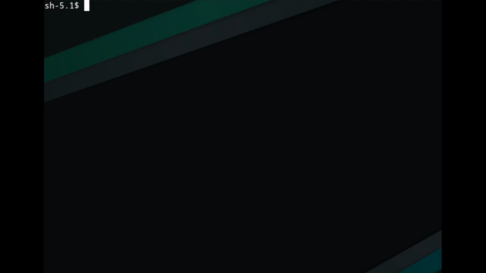

# Vaultuh
Vaultuh is a simple commandline credential manager. Vaultuh is written in Go and delegates the (symmetric) encryption to GPG.

## Installation
If you have installed Go on your system, you could use the following commands to install Vaultuh:

### (Go 1.16+)
```go install github.com/psghahremani/vaultuh@latest```

### (Older Go versions)
```GO111MODULE=on go get github.com/psghahremani/vaultuh@latest```

## How to use Vaultuh?

### Overall Flow
To start things off, you'll need to ***create a new encrypted vault***. The encrypted vault is stored as a simple ***GPG encrypted file***. Once you have an encrypted vault, you are free to ***store it under any path and name*** that you may like. You can ***safely take regular cloud backups*** of the vault (***use a strong password***). The content of the vault can be edited at anytime in order to ***add/remove crendentials***. The vault's ***password can also be changed*** at anytime. Credentials can be fetched with the help of fuzzy searching with the option to be either directly ***printed on your terminal*** or simply ***copied into the clipboard***.

### Vault Content Schema

#### General Schema
The decrypted vault is simply a ***JSON object*** that holds keys and values. The ***keys must be strings*** and the ***values must either be strings or other (non-empty) objects***. This will allow you to organize your credentials into groups and subgroups.

#### Hidden Keys
By adding a single ```_``` (underscore) at the beginning of a key name, that key and its subtree will be marked as ***hidden***. By default, the hidden keys ***will not be shown in the decrypted list*** unless you ***specifically ask for them***. This could perhaps be useful if you're sharing your screen, and you don't want some keys to be shown on the screen. Note that this is strictly about hiding ***the keys***, as by default, the values are never shown on the screen (unless you pass a certain flag). 

### Creating a New Encrypted Vault
Use ```vaultuh create``` and enter your desired password. This will create a new vault file in the current working directory and under the name ```vault```. The newly created vault file will contain some sample content to help you get started.


### Reading From The Vault
Use ```vaultuh read [path]``` and enter your password. This will decrypt the vault into the memory and give you the ability to fetch your desired credentials. Thanks to [PTerm](https://github.com/pterm/pterm), you can use ***fuzzy searching*** to find specific fields. After you select a field, by default, this command will attempt to write the value into the clipboard. If you need the value to be printed instead, pass the ```--print``` flag.

#### Hidden Keys
As mentioned before, you may mark some keys to be hidden when you add them to your vault. Upon reading from your vault, by selecting the ```_``` option in the list of decrypted fields (and re-entering your password), the hidden keys will be shown.


### Updating The Vault's Password
Use ```vaultuh update password [path]``` and enter your old and then your new password.


### Updating The Vault's Content
Use ```{EDITOR=my_favorite_editor} vaultuh update data [path]``` and enter your password. This will decrypt your vault and open an editor that allows you to modify the decrypted content. Once you're done with your edits, save the file and exit the editor. By default, ```vi``` is used as the editor, but you can provide your custom editor using the optional ```EDITOR``` environment variable (as shown in the provided example at the start of this paragraph).


## Known Issues
- There are several issues regarding the handling of Ctrl+C signals, mainly due to the fact that PTerm's interface isn't providing a distinction between INTERRUPT signals and other inputs.
- You can't edit your vault using editors that operate outside the commandline (such as Visual Studio Code). 

## "What the hell kind of name is ~~Soap~~ Vaultuh, eh?"

